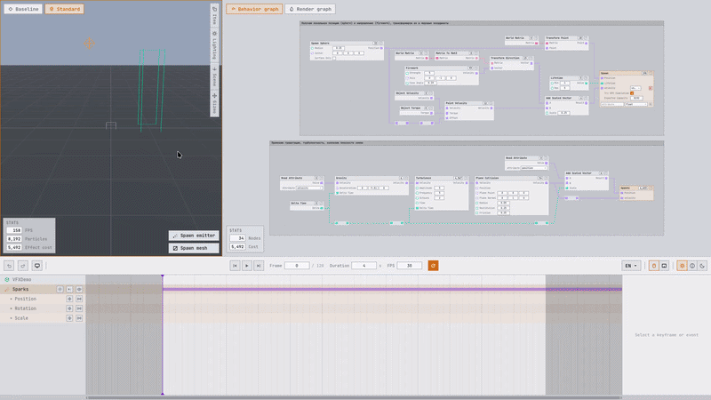

#  Sparcoon Editor

A node-based visual effects editor for three.js that runs in the browser. You build the effect from
nodes and get back one self-contained TypeScript module: no graph, no compiler and no `eval` in your
build.

**[Open the editor](https://jango-git.github.io/sparcoon-editor/)** -
[Runtime](https://github.com/jango-git/sparcoon/tree/experimental) -
[npm](https://www.npmjs.com/package/sparcoon/v/0.9.2)



> **Pre-release.** The editor works end to end, but the project format and the exported artifact are
> not frozen yet - breaking changes are possible before the first stable release. A project lives in
> your browser, so export anything you care about to `.json`.

## Who this is for

VFX artists building three.js content under hard constraints - mobile ad creatives and playables
first, where the build has a size budget, the target device may be five years old, and review will
not pass anything that generates code at runtime.

Authoring works the way it does in a game engine: emitters, spawn shapes, forces, bursts, a timeline.
The editor compiles all of it into shaders and simulation code as you work. Only the compiled result
goes to production.

If you are coming from **Unity VFX Graph, Niagara, Effekseer or PopcornFX**, the authoring model will
feel familiar. The difference is the destination: the result lives in an ordinary three.js scene.

**This is probably not what you need if** you are looking for a full 3D scene editor (only effects
are authored here), you assemble effects from data at runtime (compilation happens at authoring time
by design), you expect to drop the result in without a build step (the output is an ES module that
expects a bundler), or you work on another engine - Babylon.js, PlayCanvas, PixiJS.

### Why it will work in an ad build

- **No runtime code generation.** The export carries ready GLSL and ordinary JavaScript functions
  that your bundler sees as source. Neither `eval` nor `new Function` is used anywhere.
- **No dependency tail.** The runtime has exactly one peer dependency: `three`.
- **Old hardware has a path.** Every graph compiles to two GLSL tiers, and the Baseline tier is
  WebGL1-compatible; the runtime picks by renderer capability.
- **Instancing.** Billboards and mesh particles draw in one call per emitter.
- **The assets stay yours.** Textures and meshes are passed into the effect's constructor, so how you
  load, inline or pack them into a single file is your decision.
- **Tree-shakeable ESM with full types**, shipped unbundled and unminified so your bundler treats it
  like any other source. The target level is ES2020; for devices older than 2015, transpile it in
  your own build (Babel, SWC, your bundler's target setting).

## Quick start (nothing to install)

1. Open the **[live build](https://jango-git.github.io/sparcoon-editor/)**.
2. Press `Ctrl+Space` to open the **Content** screen, pick the **Sparks** preset and hit **Load**.
3. Close the screen and press `Space` - the effect starts playing in the viewport.
4. Change something - a node value in the graph, a burst on the timeline - and watch the preview
   rebuild while you type.
5. Go back to **Content** and hit **Export TypeScript** to get the module described below.

Nothing is uploaded anywhere: the project lives in your browser (autosaved to `localStorage`), and
`Ctrl+S` writes it out as `.json`.

## Gallery

This section will grow as the project develops.

## Using an exported effect

```sh
npm install sparcoon@experimental three
```

The runtime is published under the `experimental` tag for now: npm's `latest` holds an older release
this editor does not work with, so the tag is required.

The editor emits one module per project: a named `FXEffect` subclass plus a typed interface for the
assets the project references. `FXEffect` is a `THREE.Group`, so it behaves like any other scene
object.

```ts
import { TextureLoader } from "three";
import { FXWorld } from "sparcoon";
import { MyEffect, type MyEffectAssets } from "./effects/MyEffect"; // emitted by the editor

const loader = new TextureLoader();
const assets: MyEffectAssets = {
  spark: loader.load("spark.png"), // one entry per Texture node and per mesh the project uses
};

// Passing the renderer matters: it selects the Standard artifact (WebGL2) where available and
// enables GPU simulation. Without it the effect falls back to the Baseline tier unconditionally.
const effect = new MyEffect(assets, { renderer, camera });

scene.add(effect);
effect.play();

function frame(deltaSeconds: number): void {
  FXWorld.update(deltaSeconds); // advances the timeline and particles of every effect
  renderer.render(scene, camera);
}
```

Channels marked **Exclude from export** stay under your code's control - that is how anything which
has to follow gameplay rather than a baked curve gets wired:

```ts
effect.setEmitterParam("Sparks", "intensity", 0.7);
effect.getMesh("Shockwave")?.position.set(0, 1, 0);
```

Both calls are typed against the names the project actually declares, so a typo in an emitter or
parameter name is caught at compile time.

`effect.dispose()` frees its GPU resources and unsubscribes the effect from the world.

## What an effect is made of

A project holds one **VFX group** - the root transform of the whole effect - and any number of
objects under it:

- **Emitter** - a particle system. It owns two graphs: a **Behavior graph** (per-particle simulation)
  and a **Render graph** (per-particle material). It spawns nothing until a timeline event fires.
- **VFX mesh** - a single non-instanced mesh with a render graph and no simulation: the non-particle
  parts of an effect, such as a shockwave quad or a shaded prop.

Every graph ends in permanent **sink** nodes. The behavior graph feeds the **Spawn sink** and the
**Update sink** - initial and per-frame position, lifetime, velocity and any declared particle
attributes. The render graph feeds the **Surface sink** - color, transforms, geometry, render mode,
sorting and shadow flags.

The **timeline** owns everything time-based: **Burst** events (how many particles to release on one
frame) and **Play** events (a rate over a duration, or infinite), keyframes on **Timeline Value**
nodes - named graph inputs you can drive at runtime - and keyframes on any object's position,
rotation and scale.

## What is inside

**The node library** is split by graph. Behavior: spawn shapes (box, sphere, cone, cylinder, disc,
torus), forces (gravity, drag, point force, turbulence, curl noise), collisions (plane, box, sphere),
integration, particle attributes and the usual math. Render: textures with frame animation and UV
tiling/rotation, gradients and color ramps, HSL adjustment, fresnel, dissolve, normal maps, Lambert
and ambient shading, full matrix math, camera facing and velocity alignment.

**Assets.** Images as textures, `.hdr` environments, `.glb` / `.gltf` meshes. The **Upload asset**
button on the Content screen takes a file and sends it to the right library by type.

**Lighting.** Manual Sun and Hemisphere lights, or an active HDRI environment that drives the
viewport background, a baked light probe, and Sun's auto-derived direction and color.

**Everything else.** Undo covers every action, uploads and preset loads included. Autosave to
`localStorage`. An approximate ALU **cost** per node. Light, auto and dark themes, mouse or touchpad
navigation, and an English, Russian or Ukrainian interface, with more locales to come.

| Shortcut                     | Action              |
| ---------------------------- | ------------------- |
| `Ctrl+Z` / `Ctrl+Shift+Z`    | Undo / redo         |
| `Ctrl+S`                     | Save project JSON   |
| `Ctrl+Space`                 | Content screen      |
| `Space`                      | Play / pause        |
| `Left` / `Right`             | Step one frame      |
| `A`                          | Add node (graph)    |
| `C`                          | Add comment (graph) |
| `I`                          | Keyframe selection  |
| `F`                          | Frame / fit view    |
| `Delete` / `Backspace` / `X` | Delete selection    |

## Rendering and simulation

Graphs compile to two GLSL tiers: **Standard** (WebGL2) and **Baseline** (WebGL1-compatible). The
preview switches between them, and an export always carries both - the runtime picks by renderer
capability. The same nodes exist on both tiers, though the quality of some implementations depends on
the backend.

An emitter can additionally simulate on the GPU through transform feedback. That is enabled per
emitter (on by default) and needs a WebGL2 renderer at runtime. A graph that does not compile to a
GPU kernel runs on the JavaScript kernel, which is always compiled. This is the regular fallback
path.

## Export formats

**Project JSON** is the editable format: the whole authored document together with its assets. This
is what you hand to another artist.

**TypeScript export** is the shipping format: precompiled artifacts plus a thin subclass of the
runtime's effect class, importing only the runtime and a couple of three.js types.

## Limits

Known and deliberate, so you do not discover them mid-project:

- Environments are `.hdr` only, and drive the background and the baked light probe. No reflections,
  no PMREM. An environment stays part of the editor preview and never reaches the compiled result.
- A multi-mesh `.glb` decomposes into one asset per mesh. Uploaded meshes are baked into plain vertex
  arrays; materials and hierarchy are dropped on purpose, since the material comes from the render
  graph.
- A lit graph reads the lights of the host scene, so a lit effect needs a light probe and a
  directional light in your scene. The preview's own lighting rig is not exported.
- The **Embed assets** checkbox does nothing yet: the TypeScript export always takes its assets
  through the constructor.
- Projects travel as files. No share links, no cloud, no accounts.
- No performance measurements yet. The cost readout in the editor is a relative ALU estimate for
  comparing graphs; it cannot be read as frame time.

## Compatibility

|             |                                                                 |
| ----------- | --------------------------------------------------------------- |
| Runtime     | `sparcoon` 0.9.2 (dist-tag `experimental`)                      |
| three.js    | `>=0.157 <0.180` (peer dependency of the runtime)               |
| Editor      | Any browser with WebGL2; WebGL1 is enough for the Baseline tier |
| Your build  | A bundler (Vite, webpack, Rollup, esbuild). ES2020 output       |
| Local setup | Node 20+                                                        |

## Status

Pre-release, under active development. If you hit a bug, the most useful thing is a short screen
capture plus the project `.json` it reproduces on.

## Running locally

```sh
npm install
npm run dev     # rollup watch + dev server
npm run build   # bundle to dist/
```

`npm test` runs the Vitest suite; `npm run typecheck` and `npm run lint` cover the rest.

## License

MIT - use it in commercial work, client projects and ads that ship; keep the copyright notice. See
[LICENSE](LICENSE).
